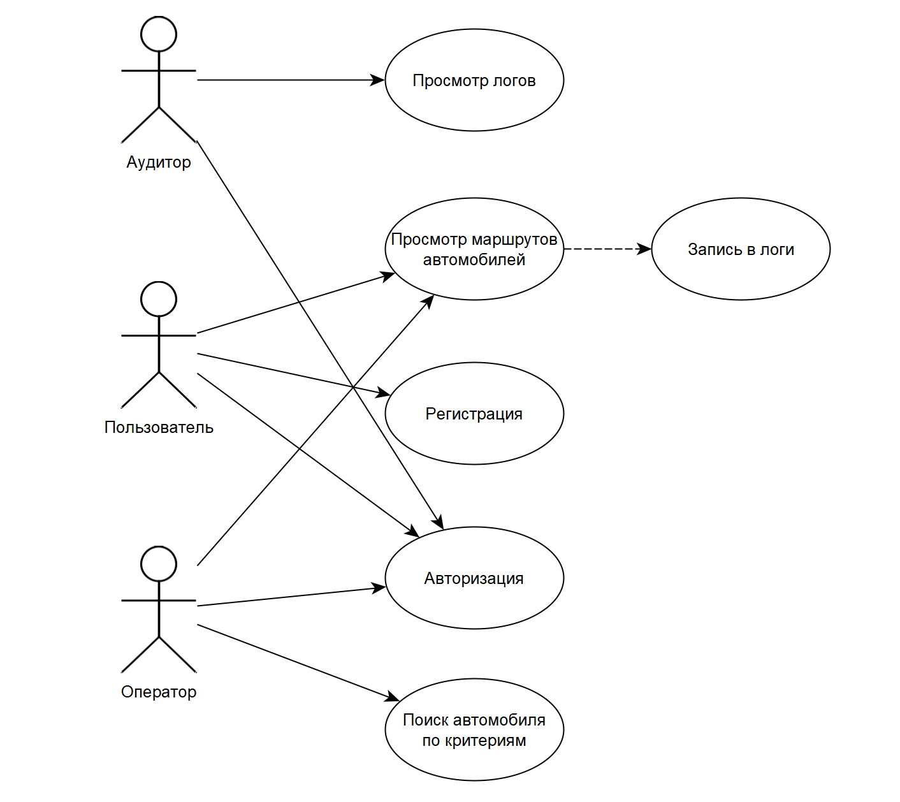
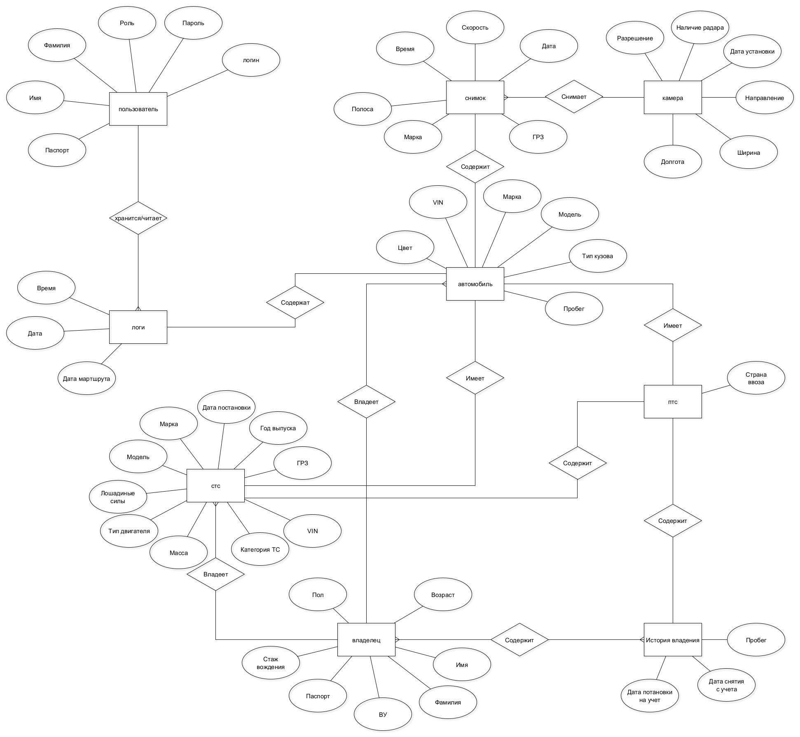
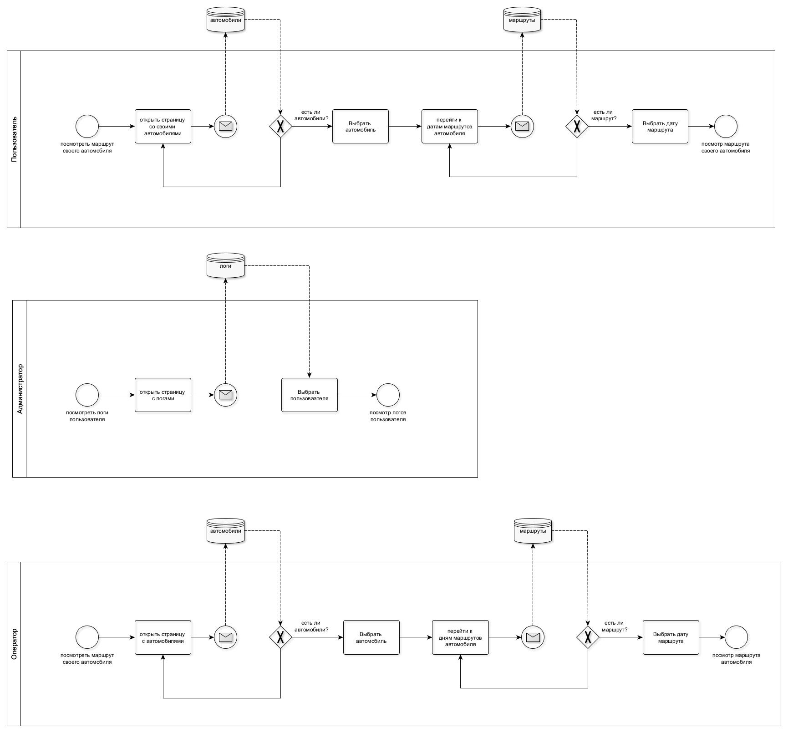

# Сервис для отслеживания маршрутов по камерам

---

## Описание

Сервис фиксирует передвижение автомобилей с помощью дорожных камер, которые регистрируют номер, скорость и время проезда. Пользователи могут просматривать только свои маршруты, тогда как операторы могут искать данные по номеру, марке и владельцу автомобиля. Аудиты контролируют доступ к информации и ведут логи всех запросов.

---

## Предмтная область

Системы отслеживания маршрутов по камерам фиксируют перемещение транспортных средств с помощью видеокамер и технологий автоматического распознавания номеров (ALPR). Они позволяют контролировать дорожную обстановку, находить угнанные автомобили, анализировать трафик и оптимизировать логистику. Такие системы применяются в правоохранительных органах, транспортных компаниях и городском управлении для повышения безопасности и эффективности передвижения.

---

## Конкуренты

| Критерий              | NSCAR.online                             | TRACE                                   | СитиПоинт                            |  
|-----------------------|-----------------------------------------|-----------------------------------------|--------------------------------------|  
| Функциональность  | Онлайн-мониторинг автопарка, архив видеозаписей | Видеонаблюдение + ГЛОНАСС/GPS, облачное хранение | Видеомониторинг транспорта, анализ резких манёвров |  
| Целевая аудитория | Владельцы автопарков, логисты          | Транспортные компании, спецтехника     | Городской транспорт, служебные автомобили |  
| Способы хранения данных | Локально и в облаке                   | Полностью облачное решение             | Локальные серверы + облако          |  

---

## Актуальность

Разработка системы отслеживания маршрутов по камерам актуальна в условиях роста транспортных потоков, необходимости повышения безопасности и эффективного управления дорожным движением. Внедрение подобных систем способствует повышению прозрачности транспортных процессов, сокращению преступности.

---

## Роли

- Пользователь - может отслеживать маршруты своих автомобилей
- Оператор - может отслеживать все маршруты для выевления аномалий поведений
- Аудит - может отслеживать логи поисков операторов и пользователей

---

## Use-case diagram

---

## ER diagram

---

## Пользовательские сценарии

- Пользователь: Авторизируется, регистрируется, следит за марштртами <u>своих</u> автомобилей;
- Оператор: Авторизируется, следит за марштртами всех автомобилей;
- Аудит: Авторизируется, просматривает логи отслеживания маршрутов операторами и пользователями.

---

## BPMN

---

## Описание типа приложения и выбранного

---

**Тип приложения:** Мобильное
**Технологический стэк:**

- ___backend:___ 
  - _Язык программирования:_ Rust
  - _Фреймворк:_
  - _СУБД:_ PostgreSQL, Redis
- ___frontend:___ Swift

## Верхнеуровневое разбиение на компоненты

---

## Диаграммы классов

---

